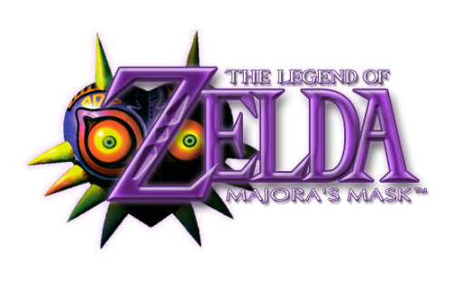

# Programación y Plataformas Web (PPW)

## Práctica 1 – Explorando los Estándares Web con HTML, CSS y JavaScript

**Asignatura:** Programación y Plataformas Web  
**Unidad:** 1.2 – Estándares Web  
**Estudiante:** Jose Vanegas  
**Repositorio:** [https://github.com/josevac1/icc-ppw-u1-mi_pagina_web)
**Página desplegada (GitHub Pages):** [https://josevac1.github.io/icc-ppw-u1-mi_pagina_web/)

---

### Estructura HTML utilizada


| Componente | Descripción | Implementación |
|-------------|--------------|----------------|
| `<!DOCTYPE html>` | Declaración del documento HTML5 | Línea 1 |
| `<html lang="es">` | Idioma del documento | Español |
| `<header>` | Encabezado principal | Contiene `<h1>`, `<h2>` y párrafos descriptivos |
| `<section>` | Agrupa contenido principal | Cuatro secciones con `<h2>` |
| `<table>` | Muestra los elementos estudiados | Tres filas con `<th>` y `<td>` |
| `<footer>` | Pie de página | Nombre del estudiante, asignatura y botón interactivo |

---

### Nuevas etiquetas exploradas

| Etiqueta | Descripción | Implementación |
|-----------|--------------|----------------|
| `<figure>` | Contenedor para imagen con pie de foto | Imagen del videojuego Zelda con `<figcaption>` |
| `<nav>` | Define una barra de navegación semántica | Enlaces a secciones: Componentes, Hobbies, Juego y Más información |

**Código usado:**
```html
<figure>
  
  <figcaption>The Legend of Zelda — Aventura épica</figcaption>
</figure>

<nav>
  <ul>
    <li><a href="#componentes">Componentes de un PC</a></li>
    <li><a href="#hobbies">Mis hobbies</a></li>
    <li><a href="#juego">Mi juego favorito</a></li>
    <li><a href="#info">Más información</a></li>
  </ul>
</nav>
```


#  Práctica 2 – Adición de CSS y JavaScript
---

### 1. Archivos agregados

| Archivo     | Descripción                                                                                         | Ubicación                 |
| ----------- | --------------------------------------------------------------------------------------------------- | ------------------------- |
| `style.css` | Contiene todos los estilos visuales del sitio (colores, tipografía, márgenes, botones, tabla, etc.) | Carpeta raíz del proyecto |
| `codigo.js` | Contiene las funciones y eventos JavaScript que agregan comportamiento dinámico                     | Carpeta raíz del proyecto |

Estructura final del proyecto:

```
icc-ppw-u1-mi_pagina_web/
│
├── antes.png
├── codigo.js
├── despues.png
├── index.html
├── README.md
├── style.css
└── zelda.png
```
---

### 2. Implementación en HTML

Los nuevos archivos se enlazaron dentro del documento `index.html` de la siguiente forma:

**En el `<head>` (para el CSS):**

```html
<link rel="stylesheet" href="style.css" />

```

**Antes de cerrar el `<body>` (para el JavaScript):**

```html
<script src="codigo.js"></script>

```

---

### 3. Estilos aplicados con CSS

* COMLETAR LA TABLA

| Elemento                    | Estilo implementado                                            | Descripción                             |
| --------------------------- | -------------------------------------------------------------- | --------------------------------------- |
| `body`                      |    `font-family: Arial, sans-serif;margin: 0;background-color: #f4f4f9; color: #333;`     |    `Fondo claro y tipografía legible`     |
| `header`                    | `background-color: #004aad;color: white;text-align: center;padding: 1.5em 0;`| `Encabezado azul con texto centrado`|
| `table`                     |  `width: 100%;border-collapse: collapse;margin-top: 10px;` | `Tabla con bordes definidos y compacta` |
| `button`                    | ` background-color: #ff7b00;color: white;border: none;padding: 10px 18px;border-radius: 6px;cursor: pointer;margin-top: 10px;` | `Botón naranja con bordes suaves`  |
| `section`                   | `  background-color: white;padding: 20px;border-radius: 10px;margin-bottom: 20px;box-shadow: 0 2px 6px rgba(0,0,0,0.1);` | `Contenedor blanco con sombra y esquinas redondeadas` |
| `progress`                  | `accent-color: #007bff; width: 100%;`                          | Personalización de la barra de progreso |

**Ejemplo en el código:**

AGREGAR DOS EJEMPLOS DE SU CODIGO CSS

```css
section {
  background-color: white;
  padding: 20px;
  border-radius: 10px;
  margin-bottom: 20px;
  box-shadow: 0 2px 6px rgba(0,0,0,0.1);
}

table {
  width: 100%;
  border-collapse: collapse;
  margin-top: 10px;
}
```
---

### 4. Interactividad agregada con JavaScript

El archivo `codigo.js` incorpora dos acciones básicas que mejoran la experiencia del usuario:

```javascript
// 1️⃣ Agregar una nueva fila a la tabla al presionar el botón
const boton = document.getElementById("agregarFila");
if (boton) {
  boton.addEventListener("click", () => {
    const tabla = document.querySelector("table");
    if (!tabla) return;
    const nuevaFila = tabla.insertRow();
    nuevaFila.innerHTML = `
      <td>&lt;article&gt;</td>
      <td>Sección independiente del contenido que puede tener su propio título.</td>
    `;
    // Efecto visual al agregar
    nuevaFila.style.backgroundColor = "#d0f0c0";
    setTimeout(() => (nuevaFila.style.backgroundColor = "white"), 1000);
  });
}

// 2️⃣ Cambiar el color del título mediante un botón
document.getElementById("colorBtn").addEventListener("click", function () {
  const h1 = document.querySelector("h1");
  const colores = ["#e63946", "#457b9d", "#2a9d8f", "#ffb703", "#9c27b0"];
  const colorAleatorio = colores[Math.floor(Math.random() * colores.length)];
  h1.style.color = colorAleatorio;
});


## Capturas de pantalla del proyecto final

* Agregar su captura de pantalla del proyecto final funcionando en el navegador, de ambas versiones (sin y con CSS/JS)
* Antes

* despues

